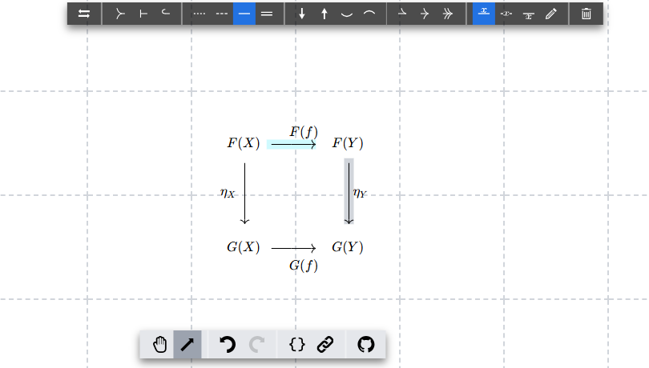

# tikzcd-editor-next

A Next.js + TypeScript + Tailwind CSS port of
[tikzcd-editor](https://github.com/yishn/tikzcd-editor) , a modern
implementation of the commutative diagram editor originally created by @yishn.



## Installation

Clone the repository:

```bash
git clone https://github.com/chantakan/tikzcd-editor-nextjs.git
cd tikzcd-editor-next
```

## Development

To start the development server, run:

```bash
npm run dev

```

## Build

To build the project, run:

```bash
npm run build
```

## Using DevContainer

To use DevContainer, follow these steps:

- Open the project in Visual Studio Code.
- Install the "Remote - Containers" extension.
- Reopen the project in the container by clicking on the green button in the
  bottom-left corner and selecting "Reopen in Container".

## Contributing

Bug reports and pull requests are welcome! Please consult the
[issues list]("https://github.com/chantakan/tikzcd-editor-nextjs/issues) for
existing issues beforehand.

License This project is licensed under the MIT License. See the
[LICENSE](./LICENSE) file for details.

## Additional Information

For more details, refer to the
[original tikzcd-editor](https://github.com/yishn/tikzcd-editor) repository.
